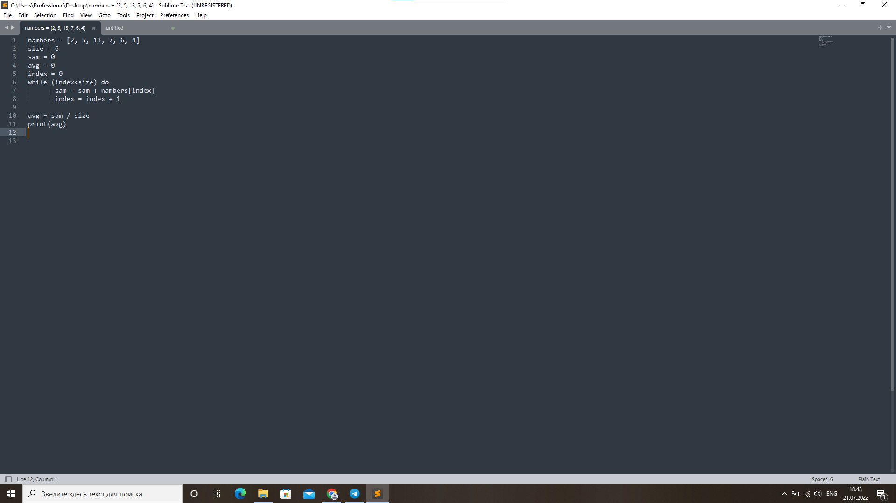

# Инструкция для работы в Markdoun

## Выделения текста

Чтобы выделить текст курсивом, необходимо обрамить его звездочками (*) или знаком нижнего подчеркивания(_) Например, *Вот так* или _вот так_.

Чтобы выдеоить текст полужирным, необходимо обрамить его двойными звездочками(**) или двойным знаком нижнего подчеркивания (__). Например, **Вот так** или __вот так__.

Альтернативные способы выделения текста полужирным или курсивом нужны для того, что бы могли совмещать оба эти способа. Например, _текст может быть выделен курсивом и при этом может быть **полужиным**_.

## Списки
Чтобы добавит ненумерованные списки, необходимо пункты выделить звездочкой(*)или знаком +. Например, вот так:
* Элемент 1
* Элемент 2
* Элемент 3
+ Элемент 4

Чтобы добавит нумерованные списки, необходимо пункты просто пронумеровать. Например, вот так:
1. Первый пункт
2. Второй пункт

## Работа с изображениями

Что бы вставить изображения в текст, достатачно написать следующие: 

## Ссылки

## Работа с таблицами

## Цитаты

## Заключение

